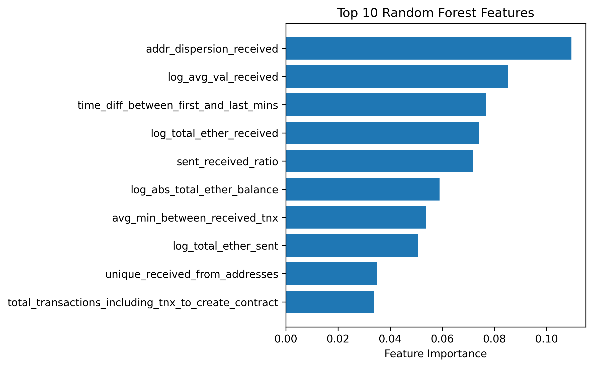
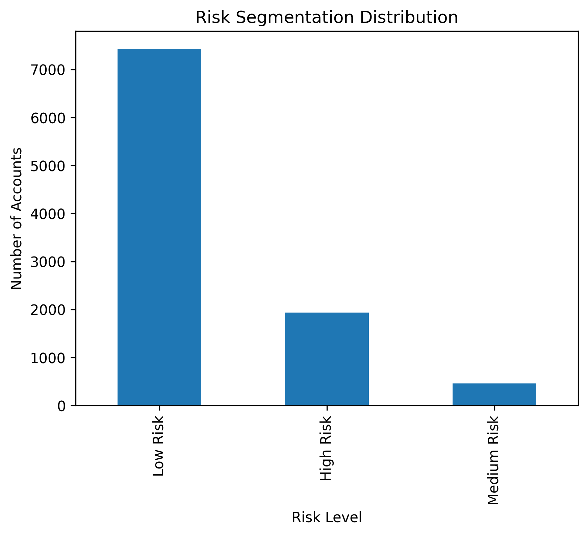

# Ethereum Wallet Fraud Detection

## Introduction

This project develops an end-to-end machine learning pipeline for detecting fraudulent Ethereum wallets using behavioural and transactional features derived from blockchain activity.

The project includes:
- ETL and feature engineering
- Multiple machine learning models
- Model comparison and evaluation
- Global feature importance analysis
- Entity-level fraud risk scoring

The final output is a risk-scored wallet dataset designed to support risk-based monitoring and investigation prioritisation.

---

# Dataset

The project uses the Kaggle Ethereum Fraud Detection Dataset:

- Dataset source:  
https://www.kaggle.com/datasets/vagifa/ethereum-frauddetection-dataset

- Local dataset path:

```text
./data/raw_ethereum_wallet_dataset.csv
```

---

# Data Description

The dataset contains Ethereum wallet-level behavioural and transactional features associated with both legitimate and fraudulent wallets.

Feature categories include:
- transaction frequency and timing
- wallet balance metrics
- sent and received transaction behaviour
- ERC20 token activity
- address interaction patterns
- network-related behavioural indicators

The target variable:
- `flag`
  - `1` = fraudulent wallet
  - `0` = legitimate wallet

---

# Project Structure

```text
ethereum-wallet-fraud-detection/
│
├── data/
│   ├── raw_ethereum_wallet_dataset.csv
│   ├── processed_wallet_fraud_dataset.parquet
│   └── risk_scored_wallets.csv
│
├── notebooks/
│   ├── ethereum_wallet_fraud_etl.ipynb
│   └── ethereum_wallet_fraud_modeling.ipynb
│
├── images/
│   ├── model_comparison.png
│   ├── rf_feature_importance.png
│   └── risk_distribution.png
│
└── README.md
```

---

# ETL Process

The ETL pipeline was implemented in:

```text
./notebooks/ethereum_wallet_fraud_etl.ipynb
```

Main ETL stages included:
- data cleaning
- missing value handling
- duplicate checks
- feature engineering
- logarithmic transformations
- ratio-based behavioural feature creation
- preparation of modelling-ready datasets

Processed dataset output:

```text
./data/processed_wallet_fraud_dataset.parquet
```

---

# Machine Learning Models

The following models were developed and evaluated:

1. Logistic Regression  
2. Decision Tree  
3. Random Forest  
4. Gradient Boosting  

The modelling workflow is implemented in:

```text
./notebooks/ethereum_wallet_fraud_modeling.ipynb
```

---

# Model Performance Comparison

The models were evaluated using:
- Accuracy
- Precision
- Recall
- F1-score
- ROC-AUC

Random Forest was selected as the best overall model due to its strong balance between fraud detection capability (recall) and false positive control (precision).

## Model Performance Comparison Table

| Model | Accuracy | Precision | Recall | F1-score | ROC-AUC |
|---|---:|---:|---:|---:|---:|
| **Random Forest** | **0.959** | **0.916** | **0.898** | **0.907** | **0.989** |
| Gradient Boosting | 0.963 | 0.955 | 0.876 | 0.914 | 0.989 |
| Logistic Regression | 0.867 | 0.642 | 0.907 | 0.752 | 0.946 |
| Decision Tree | 0.925 | 0.888 | 0.760 | 0.819 | 0.942 |
---
Random Forest was selected as the primary model due to its strong balance between recall and precision, providing effective fraud detection while maintaining low false positive rates.

# Global Feature Importance

Global feature importance analysis was conducted using the Random Forest model, with validation against Gradient Boosting to assess consistency across ensemble methods.

The most influential features were primarily associated with:
- address interaction behaviour
- transaction timing
- transaction volume
- wallet balance activity
- sent-to-received transaction patterns

## Random Forest Feature Importance

<p align="center">
  
</p>

---

# Risk Scoring Framework

The final stage of the project involved assigning fraud risk scores to individual wallet addresses using the predicted probabilities from the Random Forest model.

Wallets were categorised into:
- High Risk
- Medium Risk
- Low Risk

This enables prioritisation of high-risk entities for investigation and risk-based monitoring.

Risk Scores Distribution
<p align="center">
  
</p>

Final risk-scored dataset:

```text
./data/risk_scored_wallets.csv
```

---

# Technologies Used

- Python
- pandas
- NumPy
- scikit-learn
- matplotlib
- Jupyter Notebook

---

# Key Outcomes

- Developed an end-to-end fraud detection pipeline
- Compared multiple machine learning approaches
- Achieved near-perfect ROC-AUC performance (~0.99) using ensemble methods
- Identified key behavioural indicators of fraudulent wallets
- Built an operational risk scoring framework for entity-level fraud assessment

---

# Future Improvements

Potential future enhancements include:
- XGBoost or LightGBM implementation
- SHAP-based explainability
- Graph/network analytics
- Threshold optimisation
- Real-time wallet monitoring pipelines
